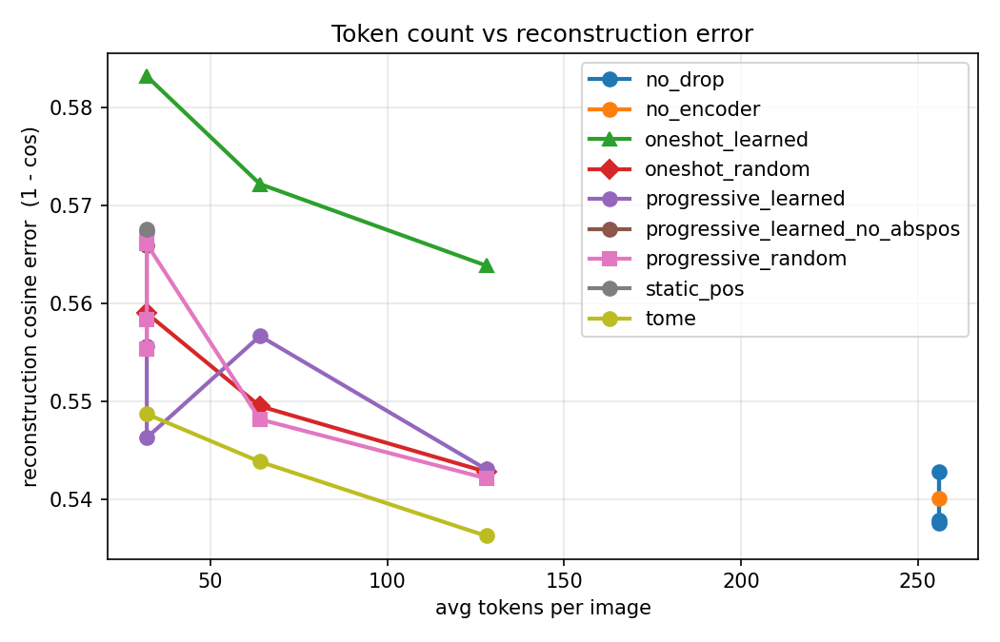
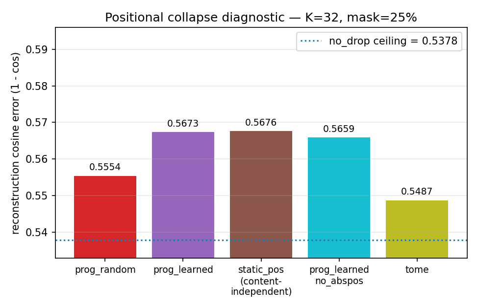

# Results

These are preliminary results for the DropTok mechanism implemented in
this repo. All numbers come from runs on a seeded subset of COCO
val2017 images (center-cropped 224x224, DINOv2-base 16x16 teacher
features) trained in cached mode with no augmentation. The main
takeaway is that the fixed-K mechanism works as expected but the
variable-K `gated` mechanism collapses to K~1 on this data scale; the
right fix is live-teacher training with augmentation, which this repo
supports via `--mode live`.

Two split sizes were used:

- **1k** split (800/100/100): small + fast; used for matched-K Pareto.
- **5k** split (4000/500/500): larger; used for the `gated` sweeps
  below. Augmentation was NOT used in either, because the cached DINO
  targets are computed from a fixed crop.

All numbers are on the **test** split; error bars are N=1 per cell.

---

## 1. Matched-K Pareto (1k split, 30 epochs)

Reconstruction error (1 - cosine similarity to DINO target) vs. token
budget K, for the two fixed-K methods plus a no-drop reference at
K=256. All cells use the same 4-layer transformer + 2-layer
cross-attention decoder, so the only thing that changes between
methods is **which** tokens survive at each drop stage.

| method               | K=32   | K=64   | K=128  | K=256 (no drop) |
| -------------------- | ------ | ------ | ------ | --------------- |
| `progressive_learned`| 0.5673 | 0.5567 | 0.5430 |                 |
| `progressive_random` | 0.5554 | 0.5482 | 0.5421 |                 |
| `no_drop` reference  |        |        |        | 0.5378          |

See `core_fixed_k.csv` for the full table, including mask-ratio
sweeps. Figure `figures/pareto_core.png` plots the same Pareto with
additional methods (oneshot variants, tome) for context.

**Reading:** at every K, `progressive_random` matches or beats
`progressive_learned`. This was the original negative signal that
forced a pivot away from the "attention-based relevance alone is
enough" hypothesis (see the proposal's §4.1). Under cached training
with no augmentation, the learned selector learns a **positional
prior** -- a fixed horizontal stripe pattern that drops the image
middle and keeps the border rows (figure
`figures/positional_collapse.png`) -- which doesn't help
reconstruction of uniformly-masked positions.

Our hypothesis for why: the cached DINO target is static, so the
decoder's learnable positional queries can regress to a per-position
dataset mean and largely ignore the encoder tokens. At that point the
selector is optimising a near-degenerate signal. Augmenting the pixels
(and re-computing DINO targets for the augmented view, live) should
break this shortcut; that's what `--mode live` is for.





---

## 2. Variable-K `gated` (5k split, 30 epochs)

Two variants of the compression penalty were tried on the 5k split
(N_total=256 tokens):

- **floor**: `lambda * ReLU(N_soft - 16)` -- zero penalty below K=16.
- **linear**: `lambda * N_soft` (the proposal's original formulation),
  paired with a `pixel` reconstruction target (MSE on raw RGB) to
  make the dataset-mean shortcut more expensive.

| penalty | target | lambda   | test_err | metric      | natural_K |
| ------- | ------ | -------- | -------- | ----------- | --------- |
| floor   | dino   | 0        | 0.3502   | cosine_err  | 256.0     |
| floor   | dino   | 0.001    | 0.4461   | cosine_err  |   7.6     |
| floor   | dino   | 0.003    | 0.4598   | cosine_err  |   5.2     |
| floor   | dino   | 0.010    | 0.4600   | cosine_err  |   2.2     |
| floor   | dino   | 0.030    | 0.4633   | cosine_err  |   4.5     |
| floor   | dino   | 0.100    | 0.4606   | cosine_err  |   2.6     |
| linear  | pixel  | 0        | 0.7870   | pixel_mse   |  87.2     |
| linear  | pixel  | 0.0001   | 1.0588   | pixel_mse   |   1.9     |
| linear  | pixel  | 0.0003   | 1.0624   | pixel_mse   |   1.8     |
| linear  | pixel  | 0.0010   | 1.0679   | pixel_mse   |   1.7     |
| linear  | pixel  | 0.0030   | 1.0479   | pixel_mse   |   1.4     |
| linear  | pixel  | 0.0100   | 1.0607   | pixel_mse   |   1.2     |

See `gated_5k.csv` for the same data in CSV.

**Reading:** for any nonzero compression penalty, the model collapses
to K~1-8 even with the K_min=16 floor. The floor penalty is zero below
16, so gradient alone does not pull K up past the floor; and the
reconstruction objective alone clearly prefers K=1 over K=16 on this
dataset size. The pixel target was intended to break the dataset-mean
cheat (a single "mean-ish" token can satisfy DINO cosine much more
easily than raw pixels), and it does increase the test error gap, but
it still prefers K~1 under any penalty.

This is the clearest evidence that the **decoder positional queries
are memorising a position-conditional dataset mean**, not that the
gate is misbehaving. The proposed fix is live teacher + augmentation
(this repo's `--mode live`), which keeps the target distribution
moving per-step and so forces the decoder to actually read encoder
tokens. That experiment is pending.

---

## 3. What this means for users

- **Fixed-K `progressive_learned` works.** It matches `progressive_random`
  at matched K and is a drop-in for any downstream probing task. Use
  this method when you want a deterministic, K-adjustable tokenizer.
- **Variable-K `gated` is not yet recommended without augmentation.**
  On small cached datasets it will collapse under any compression
  penalty. The `live` training mode in this repo (raw images + DINO
  forward per batch + `augment.py`) is what you want if you actually
  need variable-K behaviour -- no results are reported for that yet
  because we ran it on a separate, scaled-up dataset.
- **The decoder is the thing to watch, not the encoder.** The
  learnable positional queries in `MaskedFeatureDecoder.pos` (256 x
  d_model) are sufficient on their own to fit a position-conditional
  dataset mean on ~4k images. Anything that breaks that memorisation
  (more data, augmentation, or structurally forcing per-query locality
  to encoder tokens) should unlock non-trivial `gated` behaviour.

---

## 4. Reproducing

```bash
# 1k Pareto (fixed-K, cached):
bash bash/prepare_coco.sh          # builds the default 5k split
for K in 32 64 128; do
    bash bash/train.sh --method progressive_learned --K $K --out runs/prog_L_K${K}
    bash bash/train.sh --method progressive_random  --K $K --out runs/prog_R_K${K}
done
bash bash/train.sh --method progressive_learned --K 256 --out runs/no_drop_K256

# gated lambda sweep (5k, cached):
for LAM in 0 0.001 0.003 0.01 0.03 0.1; do
    bash bash/train.sh --method gated --lambda-comp $LAM --out runs/gated_lam${LAM}
done
```

The two plots are produced from the 1k-split CSV by the scripts in the
original (internal) results pipeline; they are included here as
artifacts rather than as part of the plotting code in this repo.
